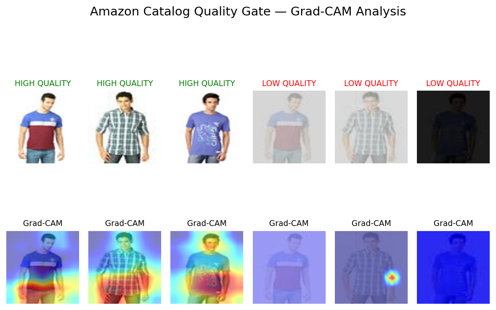
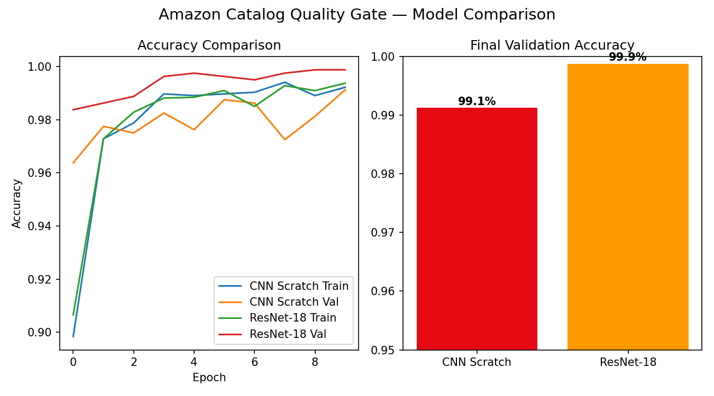

# 🛒 Amazon Catalog Quality Gate

> Automated image validation pipeline that classifies e-commerce product photos as 
> High Quality or Low Quality using CNN + ResNet-18 Transfer Learning + Grad-CAM.
> Solves the same problem Amazon, Flipkart & Myntra face with millions of daily seller uploads.

## 🎯 Business Problem

Multi-seller marketplaces receive millions of product image uploads daily from third-party sellers. 
Poor quality images (blurry, dark, low contrast) damage user experience and reduce conversions. 
Manual review at scale is impossible — this pipeline automates it.

## 📊 Results

| Model | Validation Accuracy |
|-------|-------------------|
| CNN from Scratch (3-layer) | 99.1% |
| ResNet-18 Transfer Learning | **99.9%** |

## 🔍 Grad-CAM Analysis

Grad-CAM heatmaps reveal **what the model looks at**:
- **High Quality images** → heatmap lights up entire garment (fabric texture, colors, fit)
- **Low Quality images** → cold/minimal heatmap (model finds nothing useful to analyze)

## 🏗️ Architecture

### Data Pipeline
- **Dataset:** 44,441 Myntra fashion product images
- **High Quality class:** Original crisp product shots
- **Low Quality class:** Programmatically degraded images simulating:
  - Heavy Gaussian blur (shaky phone camera)
  - Low brightness (poor lighting conditions)
  - Low contrast (washed out images)
- **Train/Val split:** 3,200 / 800 samples (balanced)

### Models
1. **Custom 3-layer CNN from scratch**
   - Conv2d(3→16) → Conv2d(16→32) → Conv2d(32→64)
   - MaxPool + Dropout(0.5) + Fully Connected
   
2. **ResNet-18 Transfer Learning**
   - Pretrained on ImageNet (frozen base layers)
   - Custom classification head for binary output
   - Grad-CAM on `layer4` for explainability

## 🛠️ Tech Stack

| Component | Tool |
|-----------|------|
| Deep Learning | PyTorch |
| CNN Architecture | Custom 3-layer + ResNet-18 |
| Explainability | Grad-CAM (pytorch-grad-cam) |
| Data Augmentation | torchvision.transforms |
| Image Degradation | PIL (GaussianBlur, Brightness, Contrast) |
| Training Platform | Google Colab (T4 GPU) |
| Dataset | Myntra Fashion Product Images (Kaggle) |

## 🚀 How to Run

1. Open `Amazon_Catalog_Quality_Gate_CNN_ResNet_GradCAM.ipynb` in Google Colab
2. Set Runtime → T4 GPU
3. Add Kaggle secrets (`KAGGLE_USERNAME`, `KAGGLE_KEY`) in Colab Secrets
4. Run all cells sequentially

## 💡 Key Learnings

- Transfer learning (ResNet-18) outperforms scratch CNN by 0.8% with faster convergence
- Synthetic data degradation is a powerful technique when labeled "bad quality" data doesn't exist
- Grad-CAM proves the model learned meaningful visual features, not shortcuts

## 🏢 Real-World Application

This pipeline mirrors what production systems at Amazon, Flipkart, and Myntra use to:
- Auto-reject blurry or poorly lit seller uploads
- Maintain consistent catalog quality at scale
- Reduce manual content moderation costs

---
Built by Preeti Bhardwaj — [github.com/mistyvisty](https://github.com/mistyvisty) | 
