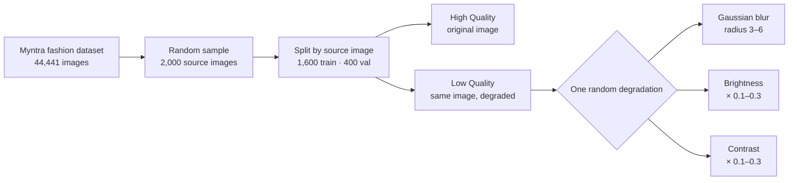
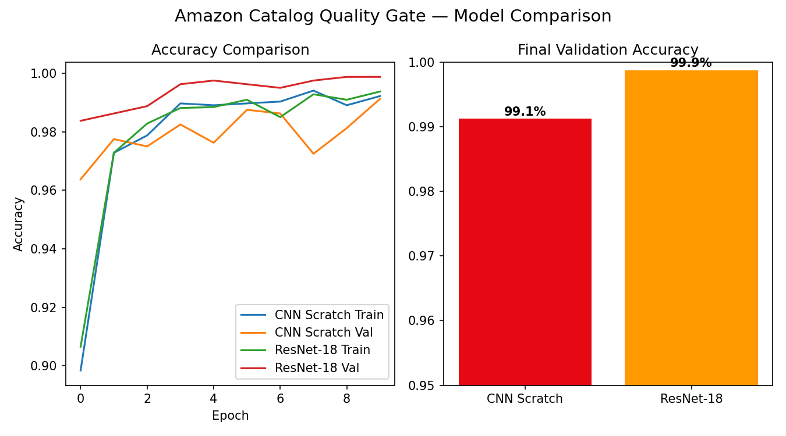
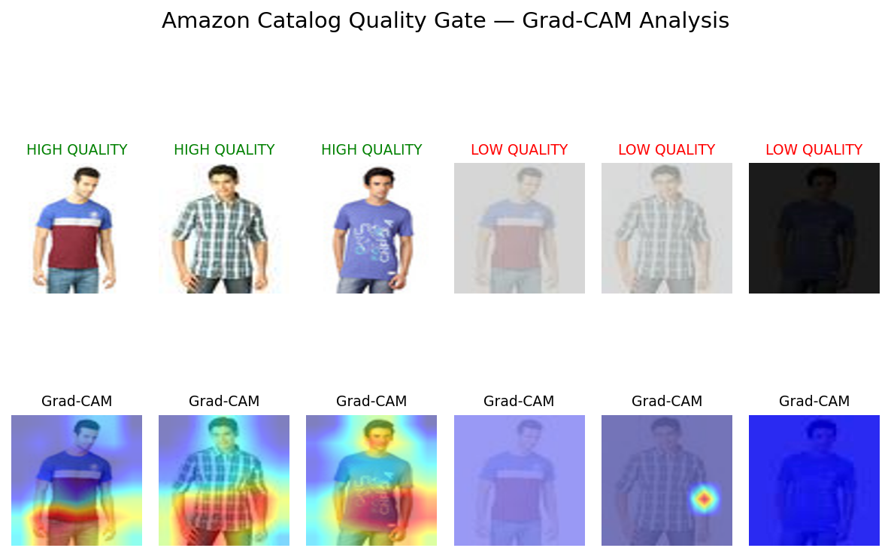

# 🛒 Catalog Image Quality Gate — CNN vs ResNet-18 + Grad-CAM

> An image-quality classifier for e-commerce product photos: it flags **blurry, dark and washed-out** images before they reach the catalog. It compares a **custom CNN built from scratch** with **ResNet-18 transfer learning**, and uses **Grad-CAM** to inspect what the model looks at.

---

## 🎯 Problem

Marketplaces with third-party sellers receive large volumes of product photos, and some are blurry, badly lit or low-contrast. Poor images hurt the shopping experience, and reviewing every upload by hand doesn't scale. A classifier can act as an automatic **quality gate**, sending only suspect images to human review.

**The data challenge:** there's no public dataset of *labeled bad product photos*. So I created the low-quality class synthetically from clean product images.

---

## 🏗️ Data Pipeline

```mermaid
flowchart LR
    A[Myntra fashion dataset<br/>44,441 images] --> B[Random sample<br/>2,000 source images]
    B --> C[Split by source image<br/>1,600 train · 400 val]
    C --> D[High Quality<br/>original image]
    C --> E[Low Quality<br/>same image, degraded]
    E --> F{One random degradation}
    F --> G[Gaussian blur<br/>radius 3–6]
    F --> H[Brightness<br/>× 0.1–0.3]
    F --> I[Contrast<br/>× 0.1–0.3]
```

- **Dataset:** [Fashion Product Images (Small)](https://www.kaggle.com/datasets/paramaggarwal/fashion-product-images-small), Myntra catalog photos (Kaggle, MIT license)
- **Each source image produces one High Quality and one Low Quality example**, so the classes are perfectly balanced: **3,200 train / 800 val**
- **The split happens before degradation**, so an image and its degraded copy are always in the same split. **No image appears in both train and validation.**
- Preprocessing: resize to 224×224, ImageNet normalization, random horizontal flip (train only)

---

## 🧠 Models

| | Custom CNN (from scratch) | ResNet-18 (transfer learning) |
|---|---|---|
| Architecture | 3 × [Conv 3×3 → ReLU → MaxPool] (16 → 32 → 64 channels) → FC(128) → Dropout(0.5) → FC(2) | ImageNet-pretrained ResNet-18, **all layers frozen**, final layer replaced with `Linear(512, 2)` |
| Trainable parameters | ~6.4M (mostly the first FC layer) | 1,026 (only the new final layer) |
| Training | Adam, lr 1e-3, 10 epochs, batch 32 | Adam, lr 1e-3, 10 epochs, batch 32 |

---

## 📊 Results

| Model | Epoch-1 val accuracy | Final val accuracy (epoch 10) |
|---|---|---|
| Custom CNN | 96.4% | 99.1% |
| ResNet-18 (frozen) | 98.4% | **99.9%** |

- **ResNet-18 learns faster and is more stable.** It reaches 98.4% after one epoch by training only a single linear layer on top of frozen ImageNet features. The CNN's validation accuracy fluctuates between 97.3% and 99.1% across epochs.
- **Pretrained features already encode blur, brightness and contrast**, so a linear classifier on top of them is enough for this task.

### ⚠️ What 99.9% does and doesn't mean

The low-quality images use **strong, synthetic degradations**, which are easy to detect. The high accuracy shows the models reliably detect *these specific degradations*. It **doesn't** show they would catch real low-quality seller photos, like mild blur, cluttered backgrounds, bad cropping or watermarks. Those were never part of training or evaluation.

---

## 🔍 Grad-CAM Analysis

Grad-CAM heatmaps are computed on ResNet-18's last convolutional block (`layer4`), for the **High Quality** class:

- **On high-quality images**, the heatmap covers the garment itself, which suggests the model uses product detail such as fabric texture and edges
- **On degraded images**, the heatmap is weak, meaning the model finds little evidence of a high-quality image

This is a qualitative check on 6 images: it **suggests** the model focuses on the product rather than the background, but it isn't proof.

---

## 🛠️ Tech Stack

| Component | Tool |
|---|---|
| Deep learning | PyTorch, torchvision |
| Models | Custom 3-layer CNN, ResNet-18 (ImageNet weights) |
| Explainability | Grad-CAM (`pytorch-grad-cam`) |
| Image degradation | PIL (`GaussianBlur`, `ImageEnhance.Brightness`, `ImageEnhance.Contrast`) |
| Data | Kaggle API |
| Training | Google Colab (T4 GPU) |

---

## 🚀 How to Run

1. Click **Open in Colab** above
2. **Runtime → Change runtime type → T4 GPU**
3. Add Colab secrets `KAGGLE_USERNAME` and `KAGGLE_KEY` (from your Kaggle account → Settings → API)
4. Run all cells in order. The dataset downloads automatically (~565 MB)

---

## 💡 Key Learnings

- **Synthetic degradation is a practical way to create labels** when no "bad quality" dataset exists, but the model only learns the degradations you generate
- **Transfer learning wins on speed and stability**, even with the whole backbone frozen
- **Very high accuracy is a reason to check the setup, not celebrate.** Here it reflects an easy task, not leakage, because the split is by source image
- **Grad-CAM is useful for sanity checks**, but a few heatmaps can't prove the absence of shortcuts

## 🔮 Next Steps

- **Robustness test:** evaluate on *milder* and *unseen* degradations (blur radius 1–2, JPEG compression, noise) to see where accuracy drops
- **Test on real low-quality photos**, e.g. a small hand-labeled set of real seller images
- Add a **separate held-out test set**, since validation accuracy is currently the only evaluation
- **Fine-tune ResNet's later layers** and compare against the frozen version on the harder test sets
- Compute Grad-CAM for the **Low Quality class** too, to see which regions trigger a rejection

---

## ⚠️ Note

This is an independent learning project. It isn't affiliated with or endorsed by any marketplace.

## 👩‍💻 Author

**Preeti Bhardwaj** — Software Developer | GenAI & Agentic Systems | RAG & LLM Engineering

[Portfolio](https://mistyvisty.github.io/) · [GitHub](https://github.com/mistyvisty) · [Medium](https://medium.com/@bhardwajpreeti357)
